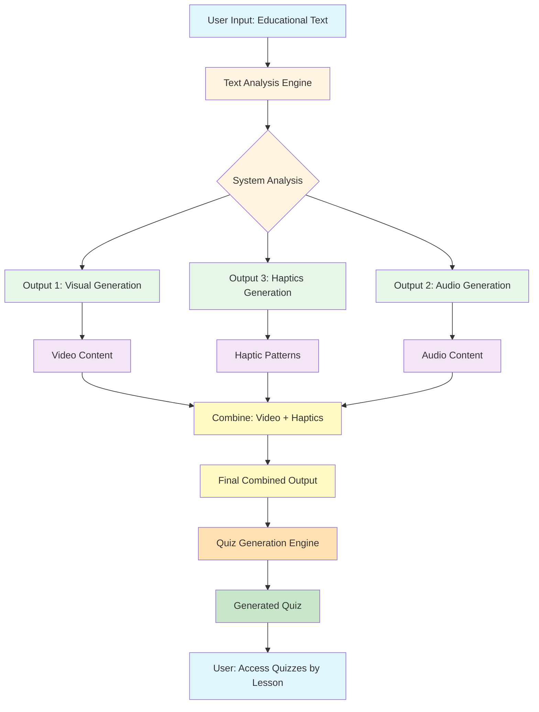
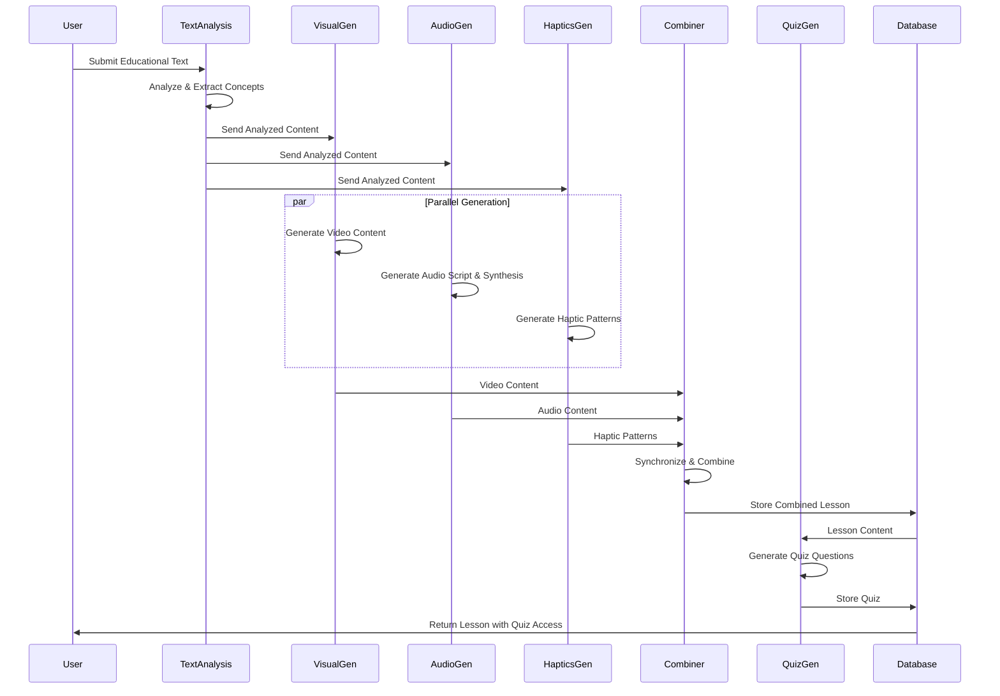

# EduSense System Architecture Diagram

## System Flow Architecture

## Detailed Component Architecture

```mermaid
graph LR
    subgraph "Input Layer"
        A[User: Educational Text Input]
    end

    subgraph "Processing Layer"
        B[NLP Text Analysis]
        C[Concept Extraction]
        D[Content Structure Analysis]
    end

    subgraph "Generation Layer - Branch 1"
        E1[Visual Scene Generator]
        E2[Video Content Creator]
    end

    subgraph "Generation Layer - Branch 2"
        F1[Audio Script Generator]
        F2[Audio Synthesis]
    end

    subgraph "Generation Layer - Branch 3"
        G1[Haptic Pattern Designer]
        G2[Haptic Feedback Generator]
    end

    subgraph "Integration Layer"
        H[Video + Haptics Combiner]
        I[Synchronization Engine]
    end

    subgraph "Output Layer"
        J[Combined Lesson Content]
        K[Quiz Generator]
        L[Quiz Output]
    end

    A --> B
    B --> C
    C --> D
    D --> E1
    D --> F1
    D --> G1

    E1 --> E2
    F1 --> F2
    G1 --> G2

    E2 --> H
    F2 --> H
    G2 --> H

    H --> I
    I --> J
    J --> K
    K --> L

    style A fill:#e1f5ff
    style B fill:#fff4e1
    style C fill:#fff4e1
    style D fill:#fff4e1
    style E1 fill:#e8f5e9
    style E2 fill:#e8f5e9
    style F1 fill:#e8f5e9
    style F2 fill:#e8f5e9
    style G1 fill:#e8f5e9
    style G2 fill:#e8f5e9
    style H fill:#fff9c4
    style I fill:#fff9c4
    style J fill:#fff9c4
    style K fill:#ffe0b2
    style L fill:#c8e6c9
```

## Data Flow Diagram

## System Components Overview

### 1. **Input Stage**

- **User Input**: Educational text provided by the user
- **Text Analysis Engine**: Processes and analyzes the input text

### 2. **Analysis Stage**

- **System Analysis**: Extracts concepts, structure, and key information
- **Content Understanding**: Identifies learning objectives and topics

### 3. **Generation Stage (3 Parallel Branches)**

- **Branch 1 - Visual Generation**:
  - Visual Scene Generator
  - Video Content Creator
  - Output: Video files/content
- **Branch 2 - Audio Generation**:
  - Audio Script Generator
  - Audio Synthesis Engine
  - Output: Audio narration files
- **Branch 3 - Haptics Generation**:
  - Haptic Pattern Designer
  - Haptic Feedback Generator
  - Output: Haptic pattern configurations

### 4. **Integration Stage**

- **Combiner**: Merges video and haptics together
- **Synchronization**: Ensures timing alignment between video, audio, and haptics
- **Final Output**: Complete lesson with multimedia content

### 5. **Quiz Generation Stage**

- **Quiz Generator**: Creates assessment questions based on lesson content
- **Output**: Quiz with questions related to the lesson

### 6. **User Access**

- Users can access quizzes according to their lessons
- Quiz results are tracked and stored

## Technology Stack (Proposed)

- **Text Analysis**: NLP models (BERT, GPT-based models)
- **Visual Generation**: Video generation APIs or models
- **Audio Generation**: Text-to-Speech (TTS) engines
- **Haptics Generation**: Haptic pattern design algorithms
- **Quiz Generation**: Question generation models
- **Backend**: Node.js/Python API
- **Database**: MongoDB for lesson and quiz storage
- **Frontend**: React Native (Expo) mobile app
